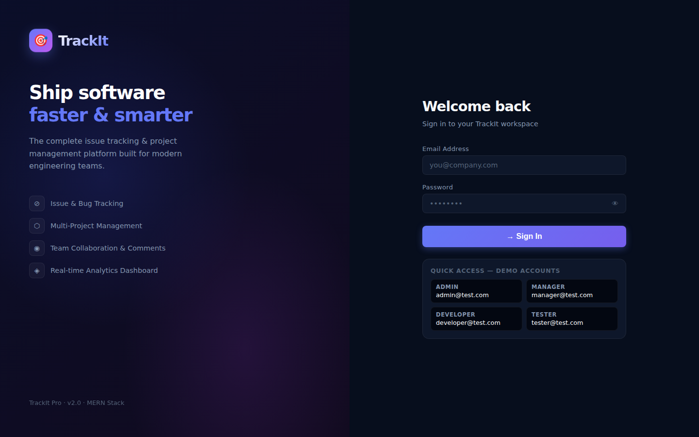
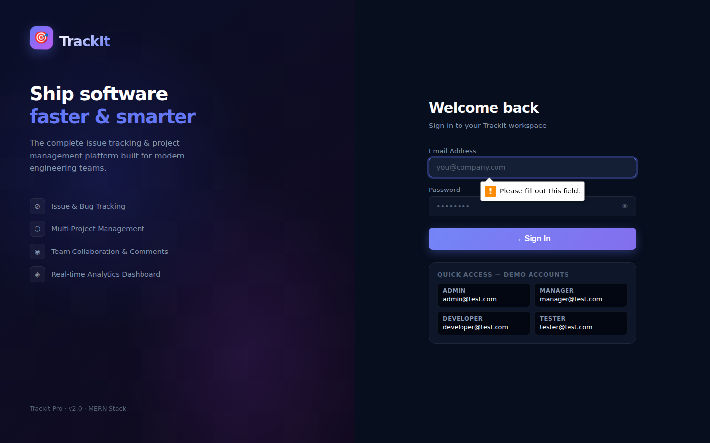
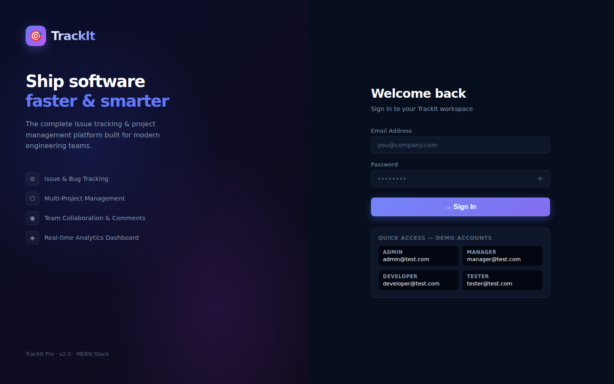

<div align="center">

# TrackIt Pro

**The complete issue tracking and project management platform for modern engineering teams.**

[](https://trackit-pro-rho.vercel.app)
[](https://react.dev)
[](https://nodejs.org)
[](https://mongodb.com)

</div>

---

## Live Demo

**[https://trackit-pro-rho.vercel.app](https://trackit-pro-rho.vercel.app)**

---

## Screenshots

### Login

Split-screen login with brand panel, feature highlights, and one-click demo account access.



---

### Dashboard

Real-time analytics with stat cards, SVG donut chart, priority matrix, activity timeline, and top-performer leaderboard.



---

### Issues — Kanban Board

Visual issue tracking across 5 status columns: Open, In Progress, Testing, Resolved, and Closed. Includes a list view toggle and inline detail modal with status change, comments, and metadata.


---

### Projects

Category-colored project cards with member avatar stacks, search, status filter, pagination, and full create, edit, and delete flow.


---

### Team Directory

Role-colored user cards with role summary chips, search by name or email, and role filter.



---

### Discussions

Thread-style comment view linked to issues and projects, with role-colored author avatars and search.


---

### Profile

Hero card with avatar, role badge, and membership date. Activity stats, issue breakdown progress bars, and full issue history.


---

## Features

| Feature | Description |
|---------|-------------|
| Kanban Board | 5-column visual board — Open, In Progress, Testing, Resolved, Closed |
| Analytics Dashboard | Live stats, donut chart, priority matrix, activity timeline |
| Project Management | Full CRUD with category colors, member stacks, and pagination |
| Team Directory | Role-colored cards with search and role filter |
| Discussions | Comment threads linked to issues with project context |
| Profile | Activity stats and issue breakdown per user |
| Role-Based Access Control | Admin, Manager, Developer, and Tester with permission-aware UI |
| Toast Notifications | Custom success, error, info, and warning notification system |
| Premium Dark UI | Aurora backgrounds, glassmorphism navbar, 3D card hover effects |

---

## Tech Stack

| Layer | Technology |
|-------|------------|
| Frontend | React 19, React Router v7, Custom CSS Design System |
| Backend | Node.js, Express 5 |
| Database | MongoDB, Mongoose |
| Authentication | JWT, bcryptjs |
| HTTP Client | Axios with interceptors |
| Deployment | Vercel |

---

## Project Structure

```
trackit-pro/
├── frontend/                  # React application
│   ├── src/
│   │   ├── components/        # Navbar, Toast, DonutChart
│   │   ├── pages/             # Dashboard, Issues, Projects, Users, Comments, Profile, Login
│   │   ├── context/           # AuthContext (JWT auth state)
│   │   └── services/          # Axios API client
│   ├── public/
│   └── vercel.json            # SPA rewrite rules
├── backend/                   # Express REST API
│   └── src/
│       ├── routes/            # Auth, Issues, Projects, Users, Comments
│       ├── models/            # Mongoose schemas
│       ├── controllers/       # Business logic
│       └── middleware/        # Auth guard, role check
├── docs/
│   └── screenshots/           # App screenshots
├── package.json               # Monorepo root scripts
└── README.md
```

---

## Getting Started

### Prerequisites

- Node.js 18 or higher
- MongoDB (local or Atlas)

### 1. Clone the repository

```bash
git clone https://github.com/Sandeepsrinivasan-14/trackit-pro.git
cd trackit-pro
```

### 2. Configure and start the backend

```bash
cd backend
npm install
```

Create a `.env` file inside `backend/`:

```env
MONGO_URI=your_mongodb_connection_string
JWT_SECRET=your_jwt_secret
PORT=5000
```

```bash
npm run dev
# API available at http://localhost:5000
```

### 3. Start the frontend

```bash
cd frontend
npm install
npm start
# App available at http://localhost:3000
```

---

## Roles and Permissions

| Role | Access |
|------|--------|
| Admin | Full access — manage users, all projects, all issues, delete any comment |
| Manager | Create and manage projects, assign issues to developers |
| Developer | View assigned issues, update status, post comments |
| Tester | Report issues, update testing status |

---

## License

MIT © [Sandeep Srinivasan](https://github.com/Sandeepsrinivasan-14)
